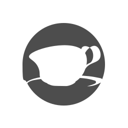

#  GitHub Webhook Rust

![GitHub Contributors](https://img.shields.io/github/contributors/ideal-state%2Fgithub-webhook-rust?style=flat-square&logo=data%3Aimage%2Fsvg%2Bxml%3Bcharset%3Dutf-8%3Bbase64%2CPD94bWwgdmVyc2lvbj0iMS4wIiBlbmNvZGluZz0iVVRGLTgiPz4KPHN2ZyB4bWxucz0iaHR0cDovL3d3dy53My5vcmcvMjAwMC9zdmciIHZlcnNpb249IjEuMSIgdmlld0JveD0iMCAwIDE2IDE2Ij4KICA8ZGVmcz4KICAgIDxzdHlsZT4KICAgICAgLmNscy0xIHsKICAgICAgICBmaWxsOiAjZmZmOwogICAgICB9CiAgICA8L3N0eWxlPgogIDwvZGVmcz4KICA8Zz4KICAgIDxnIGlkPSJwZW9wbGUiPgogICAgICA8cGF0aCBjbGFzcz0iY2xzLTEiIGQ9Ik0yLDUuNWMwLTEuOSwxLjYtMy41LDMuNS0zLjUsMS45LDAsMy41LDEuNiwzLjUsMy41LDAsMS0uNCwxLjktMS4xLDIuNSwxLjYuOCwyLjcsMi4zLDMsNC4xLDAsLjQtLjIuOC0uNi45LS40LDAtLjgtLjItLjktLjZoMGMtLjMtMi4yLTIuNC0zLjctNC42LTMuMy0xLjcuMy0zLDEuNi0zLjMsMy4zLDAsLjQtLjQuNy0uOS42LS40LDAtLjctLjQtLjYtLjloMGMuMy0xLjgsMS40LTMuMywzLTQuMS0uNy0uNy0xLjEtMS42LTEuMS0yLjZaTTExLDRjMS43LDAsMywxLjMsMywzLDAsLjctLjMsMS41LS44LDIsMS4yLjYsMi4yLDEuNywyLjYsMywuMS40LDAsLjgtLjUuOS0uMSwwLS4zLDAtLjQsMC0uMywwLS41LS4zLS41LS41LS40LTEuMi0xLjMtMi4xLTIuNS0yLjQtLjMsMC0uNi0uNC0uNi0uN3YtLjRjMC0uMy4yLS41LjQtLjcuNy0uNCwxLTEuMy43LTItLjMtLjUtLjgtLjgtMS4zLS44LS40LDAtLjgtLjMtLjgtLjhzLjMtLjguOC0uOFpNNS41LDMuNWMtMS4xLDAtMiwuOC0yLDIsMCwxLjEuOCwyLDIsMiwwLDAsMCwwLDAsMCwxLjEsMCwyLS45LDItMiwwLTEuMS0uOS0xLjktMi0yWiIvPgogICAgPC9nPgogIDwvZz4KPC9zdmc%2B)


### [📖 使用文档](https://docs.idealstate.team/github-webhook-rust/) &ensp; [📢 贡献指南](https://docs.idealstate.team/guide/contribution/)


### ☑️ 如何构建

```shell
# 1. 克隆项目到本地
git clone https://GitHub.com/ideal-state/github-webhook-rust.git
# 2. 进入项目根目录
cd ./github-webhook-rust
# 3. 获取依赖项
cargo fetch
# 4. 构建工件
cargo build --release
```

### ☑️ 如何使用

#### 运行容器

```shell
# 1. 创建数据卷
docker volume create --name github-webhook-rust
# 2. 运行容器
docker run -d -p 9527:9527 -v github-webhook-rust:/etc/github-webhook-rust ketikai/github-webhook-rust:latest
```

#### 环境变量

- `GWR_HOSTNAME`: 主机名，默认为 `0.0.0.0`
- `GWR_PORT`: 服务端口，默认为 `9527`
- `GWR_TLS`: 是否启用 TLS，默认为 `false`
- `GWR_WORKERS`: 工作线程数，默认为 `0`，即 CPU 核心数

#### 消息签名密钥

于数据卷下 `secret` 文件内填写。

#### TLS 证书

默认提供了一组自签名证书作为示例（不安全）使用，位于数据卷下 `certificates` 文件夹内。

建议使用 [`mkcert`](https://github.com/FiloSottile/mkcert/) 工具建立可信证书。若要启用本地CA认证，请执行：

```shell
mkcert -install
```

如需生成自定义证书/私钥文件，请运行：

```shell
mkcert -key-file key.pem -cert-file cert.pem 127.0.0.1 localhost
```

#### 配置推送频道

默认提供了一个 `Telegram Bot` 的模版频道目录及文件结构示例，位于数据卷下 `channels` 文件夹内。

##### 属性占位符

格式为：`${...}`
占位符可能取自以下内容中：
- 频道配置文件 `config.json` 中的 `properties`
- 事件消息体（展平后）中的任意属性
- `${__message__}` 表示解析后的模版消息内容，此项仅在 `config.json` 中的 `request` 的 `body` 中有效

优先级：`${__message__}` > 事件消息体属性 > 频道配置文件属性
